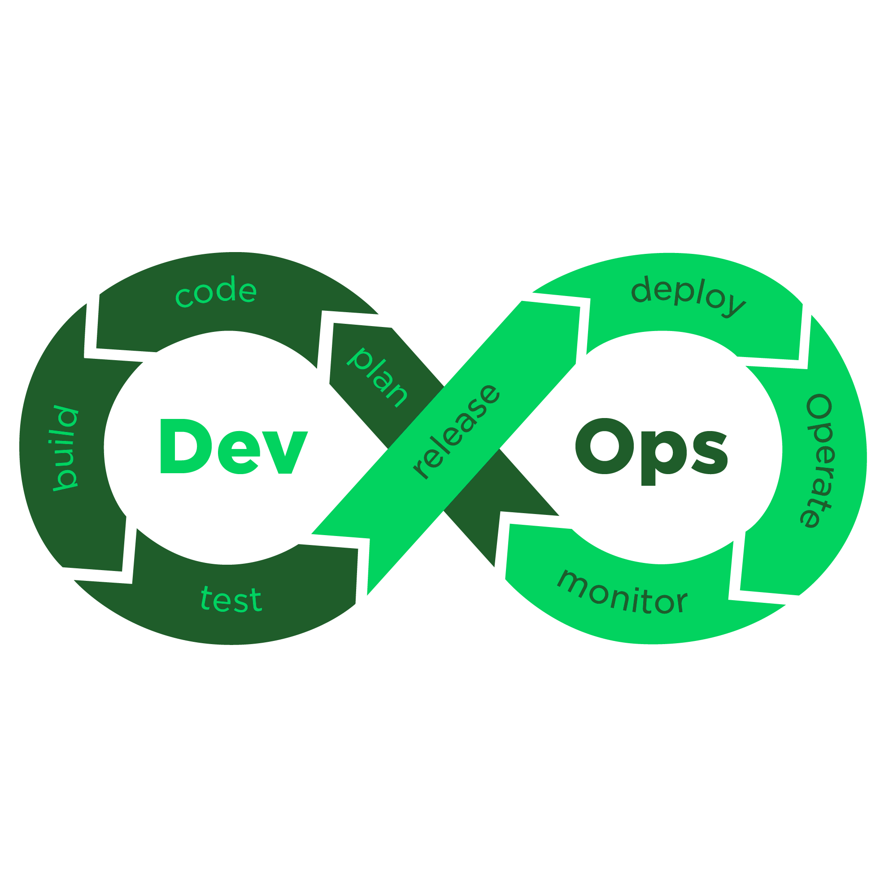

# DevOps Toolset

[](https://github.com/ahead-labs-open-source/devops-toolset/commits/)
[](https://github.com/ahead-labs-open-source/devops-toolset/tags)
[](https://github.com/ahead-labs-open-source/devops-toolset/blob/main/LICENSE)
[](https://github.com/ahead-labs-open-source/devops-toolset)
[](https://github.com/ahead-labs-open-source/devops-toolset)

[](https://github.com/ahead-labs-open-source/devops-toolset/actions/workflows/ci.yml?query=branch%3Amain)
[](https://github.com/ahead-labs-open-source/devops-toolset/actions/workflows/cd.yml?query=branch%3Amain)
[](https://sonarcloud.io/dashboard?id=ahead-labs-open-source_devops-toolset&branch=main)
[](https://sonarcloud.io/dashboard?id=ahead-labs-open-source_devops-toolset&branch=main)
[](https://sonarcloud.io/dashboard?id=ahead-labs-open-source_devops-toolset&branch=main)
[](https://sonarcloud.io/dashboard?id=ahead-labs-open-source_devops-toolset&branch=main)

> _"Everything that can be automated, must be automated!"_



## 📖 Description

DevOps Toolset is a comprehensive Python library that provides general-purpose, DevOps-related scripts, tools, and utilities. It's designed to streamline and automate common DevOps tasks across multiple platforms and project types, making your CI/CD pipelines more efficient and maintainable.

## ✨ Features

- **Multi-platform Support**: Works with Azure DevOps, AWS, GitHub, and HCP Terraform
- **Project Type Support**: Specialized tools for Angular, .NET, Node.js, WordPress, PHP, Postman, Linux, Maven, and Azure projects
- **Internationalization (i18n)**: Built-in support for multiple languages
- **Logging & Diagnostics**: Comprehensive logging capabilities with customizable formatters
- **File System Operations**: Rich set of file system utilities, parsers, and tools
- **CLI Automation**: Tools for command-line automation and subprocess management
- **Git & SVN Integration**: Version control system utilities
- **Extensible Architecture**: Modular design with easy-to-extend commands and literals

## 🚀 Getting Started

### Prerequisites

- **Python 3.9+** (supports 3.9, 3.10, 3.11, 3.12, 3.13, 3.14)
- **pip** package manager

### Installation

Install from the PyPI package index:

```bash
pip install devops-toolset
```

### Basic Usage

Import and use the toolset in your Python scripts:

```python
from devops_toolset.core.app import App
from devops_toolset.core.commands_core import CommandsCore
from devops_toolset.core.literals_core import LiteralsCore

# Initialize the application
app = App()

# Access commands and literals for your specific needs
commands = CommandsCore()
literals = LiteralsCore()
```

## 🧪 Running Tests

Install development dependencies:

```bash
pip install -r requirements-dev.txt
```

Run tests with pytest:

```bash
pytest
```

## 📁 Project Structure

```
devops-toolset/
├── src/devops_toolset/
│   ├── core/                    # Core application logic, settings, and logging
│   │   ├── app.py               # Main application bootstrapping
│   │   ├── commands_core.py     # Base commands infrastructure
│   │   ├── literals_core.py     # Base literals/translations infrastructure
│   │   ├── log_setup.py         # Logging configuration
│   │   └── settings.json        # Application settings
│   │
│   ├── devops_platforms/        # Platform-specific implementations
│   │   ├── azuredevops/         # Azure DevOps integration
│   │   ├── aws/                 # AWS integration
│   │   ├── github/              # GitHub integration
│   │   ├── hcp_terraform/       # HCP Terraform integration
│   │   └── sonarx.py            # SonarQube/SonarCloud utilities
│   │
│   ├── project_types/           # Project type-specific tools
│   │   ├── angular/             # Angular project utilities
│   │   ├── aws/                 # AWS project utilities
│   │   ├── azure/               # Azure project utilities (Functions, Static Web Apps)
│   │   ├── dotnet/              # .NET project utilities
│   │   ├── linux/               # Linux utilities
│   │   ├── maven/               # Maven project utilities
│   │   ├── node/                # Node.js project utilities
│   │   ├── php/                 # PHP project utilities
│   │   ├── postman/             # Postman collection utilities
│   │   └── wordpress/           # WordPress utilities (WP-CLI integration)
│   │
│   ├── filesystem/              # File system operations
│   │   ├── parsers.py           # File parsers (XML, JSON, etc.)
│   │   ├── paths.py             # Path manipulation utilities
│   │   ├── tools.py             # General file system tools
│   │   └── zip.py               # Archive operations
│   │
│   ├── tools/                   # General-purpose tools
│   │   ├── cli.py               # CLI and subprocess utilities
│   │   ├── git.py               # Git operations
│   │   ├── svn.py               # SVN operations
│   │   ├── dicts.py             # Dictionary utilities
│   │   ├── http_protocol.py    # HTTP utilities
│   │   └── xmlparser.py         # XML parsing utilities
│   │
│   ├── i18n/                    # Internationalization
│   │   ├── loader.py            # i18n loader
│   │   └── literals.py          # Translation literals
│   │
│   ├── locales/                 # Translation files
│   │   └── */LC_MESSAGES/       # Language-specific translations
│   │
│   └── json_schemas/            # JSON schemas for validation
│
├── tests/                       # Test suite
│   ├── core/                    # Core tests
│   ├── devops_platforms/        # Platform tests
│   ├── project_types/           # Project type tests
│   ├── filesystem/              # Filesystem tests
│   └── tools/                   # Tools tests
│
├── project.xml                  # Project metadata and version
├── setup.py                     # Package setup configuration
├── pyproject.toml               # Build system configuration
├── requirements.txt             # Production dependencies
└── requirements-dev.txt         # Development dependencies
```

## 🔧 Key Modules

### Core
- **App**: Application bootstrapping and initialization
- **CommandsCore**: Centralized command management
- **LiteralsCore**: Internationalization and string literals
- **Log Setup**: Configurable logging infrastructure

### DevOps Platforms
- **Azure DevOps**: Build definitions, pipelines, work items
- **AWS**: Resource management and deployment
- **GitHub**: Repository operations
- **HCP Terraform**: Infrastructure as Code operations

### Project Types
Each project type module provides specialized commands, utilities, and automation:
- **.NET**: Build, test, EF migrations, package management
- **Angular**: Build and deployment utilities
- **Node.js**: npm operations and project management
- **WordPress**: WP-CLI integration, theme/plugin management
- **Postman**: Collection management and API testing

### Tools
- **CLI**: Subprocess execution, title printing, command-line operations
- **Git/SVN**: Version control operations
- **File System**: Parsing, path manipulation, zip operations

## 🌐 WordPress Tools

This toolset includes comprehensive WordPress automation using WP-CLI. For more information, refer to the [WP-CLI Handbook](https://make.wordpress.org/cli/handbook/).

## 📝 Configuration

Configure platform-specific settings in `src/devops_toolset/core/settings.json`. The default platform is Azure DevOps.

## 🤝 Contributing

Contributions are welcome! Please follow the existing code structure and naming conventions:
- Use lowercase, underscore-separated names for Python files
- Place platform-specific code in the appropriate `devops_platforms/` subdirectory
- Add tests for new functionality in the corresponding `tests/` subdirectory

## 📄 License

This project is licensed under the MIT License. See the [LICENSE](LICENSE) file for details.

## 🔗 Links

- **PyPI Package**: [https://pypi.org/project/devops-toolset/](https://pypi.org/project/devops-toolset/)
- **GitHub Repository**: [https://github.com/ahead-labs-open-source/devops-toolset](https://github.com/ahead-labs-open-source/devops-toolset)
- **Issues**: [https://github.com/ahead-labs-open-source/devops-toolset/issues](https://github.com/ahead-labs-open-source/devops-toolset/issues)

## 🏢 Organization

Maintained by **Ahead Labs**

---

_Current version: 2.21.0_

